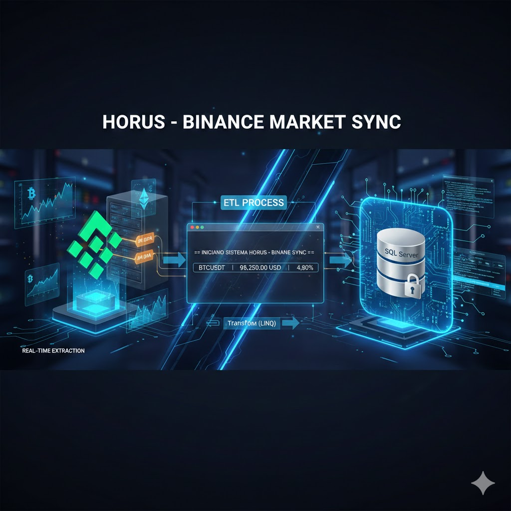
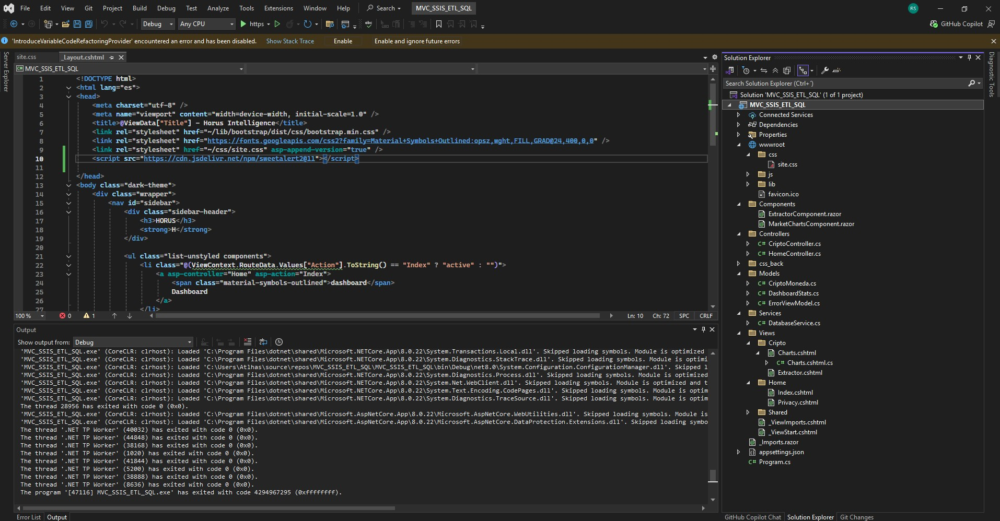
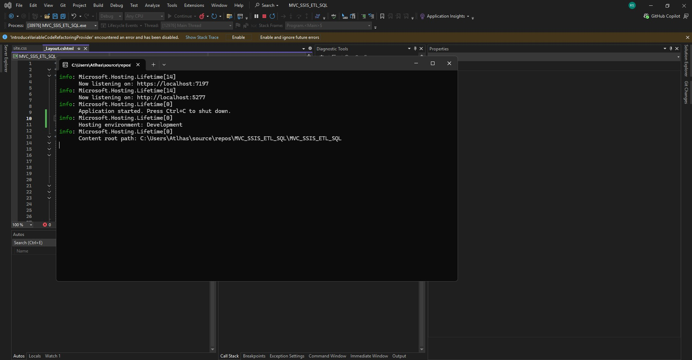
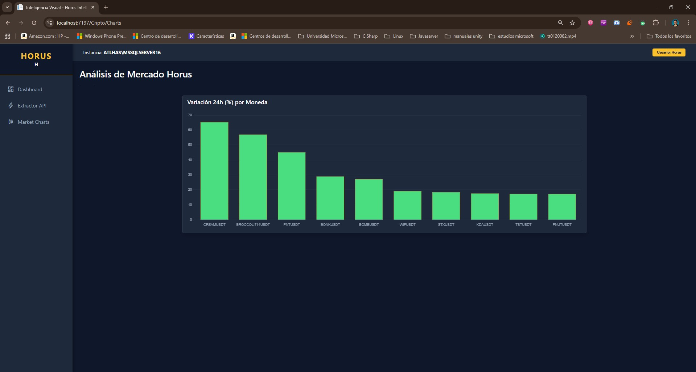
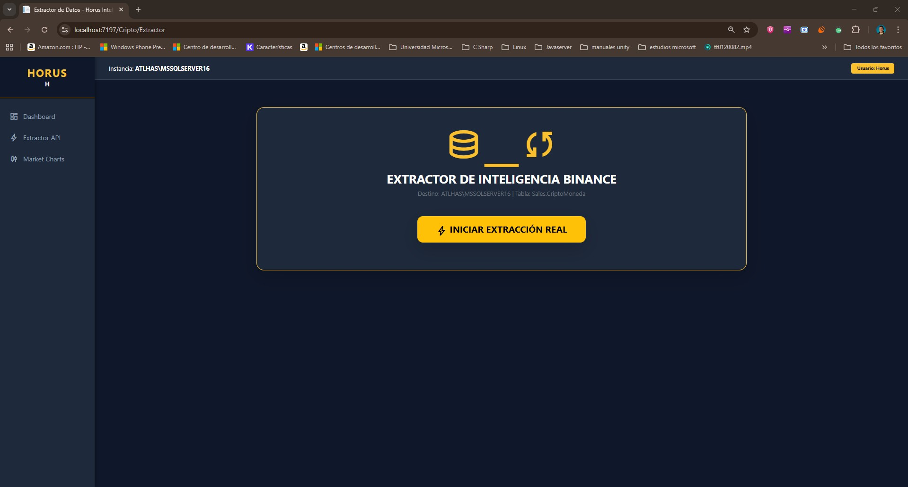

# Horus - Custom ETL & Binance Market Sync 📈

**Horus** es una solución de ingeniería de datos de alto rendimiento desarrollada en **.NET 8** que implementa un proceso **ETL (Extract, Transform, Load)** robusto. Diseñado como una alternativa programática, escalable y ligera a los paquetes tradicionales de **SSIS (SQL Server Integration Services)**, este sistema automatiza la ingesta, procesamiento y persistencia de activos financieros desde la API de Binance hacia **SQL Server**.

---

## �� Presentación del Proyecto



*Visión estratégica del Sistema Horus como plataforma de integración de datos de próxima generación.*

---

## 🏗️ Capacidades de Ingeniería (Arquitectura ETL)

Este proyecto trasciende una aplicación de consola convencional; es un motor de integración de datos que replica la lógica de **SSIS** mediante código limpio y eficiente:

* **Extract (Extracción):** Consumo asíncrono de la API REST de Binance (`/api/v3/ticker/24hr`) mediante `HttpClient`, manejando grandes volúmenes de datos JSON en tiempo real.
* **Transform (Transformación):** Motor de reglas de negocio basado en **LINQ** para el filtrado de pares `USDT`, ordenamiento dinámico por volatilidad (`priceChangePercent`) y selección automatizada del Top 10 del mercado.
* **Load (Carga):** Pipeline de persistencia optimizado en SQL Server que implementa una estrategia de "Truncate and Load" para garantizar que el ranking visualizado sea siempre el más reciente.

---

## 🛠️ Stack Tecnológico y Dependencias

* **Lenguaje:** C# 12.
* **Framework:** .NET 8.0 (LTS).
* **Base de Datos:** SQL Server (Instancia `ATLHAS` / AdventureWorks).
* **Bibliotecas (NuGet):**
    * `Newtonsoft.Json` (v13.0.4): Procesamiento y deserialización de alta velocidad.
    * `Microsoft.Data.SqlClient` (v6.1.3): Conectividad moderna y segura para SQL Server.

---

## �� Conceptos Avanzados y Patrones Aplicados

### 🧩 Alternativa Programática a SSIS
A diferencia de los flujos visuales de Integration Services, este motor ofrece:
* **Mayor Control:** Manejo de excepciones personalizado y lógica de reintentos asíncronos.
* **Ligereza:** Ejecución directa sobre el runtime de .NET sin dependencia de servicios externos de SSIS.
* **Mantenibilidad:** Código fuente totalmente versionable (Git) y listo para pipelines de CI/CD.

### ⚡ Programación Asíncrona (Async/Await)
Implementación del patrón **TAP (Task-based Asynchronous Pattern)** en todas las capas. Se utilizan métodos no bloqueantes como `GetStringAsync`, `OpenAsync`, `ExecuteNonQueryAsync` y `ReadAsync` para optimizar el uso de hilos y la escalabilidad.

### 🔒 Seguridad y Robustez de Datos
* **Protección contra SQL Injection:** Uso estricto de comandos parametrizados (`SqlParameter`) para todas las inserciones.
* **Resiliencia de Esquema (DDL Automático):** Lógica embebida que verifica y crea automáticamente la estructura de tablas (`Sales.CriptoMoneda`) si no existe en el sistema.
* **Separación de Responsabilidades (SoC):** Arquitectura desacoplada mediante clases POCO y servicios de base de datos independientes.

---

## 📋 Estructura de la Solución

| Componente | Rol en el Proceso ETL |
| :--- | :--- |
| `BinanceTicker.cs` | **Data Contract:** Define objetos POCO para mapear atributos de la API (`symbol`, `lastPrice`, etc.). |
| `DatabaseService.cs` | **Data Access Layer:** Encapsula la gestión de conexiones, seguridad e integridad de la DB. |
| `Program.cs` | **ETL Orchestrator:** Gestiona el ciclo de vida del flujo: Fetch -> Transform -> Load. |

---

## 🚀 Guía de Instalación y Uso

### Requisitos Previos
* Visual Studio 2022 o VS Code con SDK de **.NET 8**.
* Instancia de **SQL Server** activa (Local o Azure SQL).

### Configuración Rápida
1.  **Ajustar Conexión:** Actualiza la `_connectionString` en `DatabaseService.cs` con tus credenciales:
    ```csharp
    _connectionString = @"Server=TU_SERVIDOR;Database=AdventureWorks2016_EXT;User Id=Horus;Password=1130;Encrypt=True;TrustServerCertificate=True;";
    ```
2.  **Ejecutar:**
    ```bash
    dotnet restore
    dotnet run
    ```

---

## 📊 Visualización de Resultados

### Entorno de Desarrollo y Ejecución



*Captura del entorno integrado de Visual Studio 2022 mostrando la estructura del proyecto, editores de código con sintaxis resaltada y ventanas de diagnóstico de la solución Horus.*



*Métricas de tiempo de ejecución y desempeño del pipeline ETL, demostrando la eficiencia del procesamiento asíncrono y consumo de recursos optimizado.*

### Ejecución de la Aplicación


*Estado inicial de la aplicación durante el bootstrap, mostrando validación de conexiones y preparación de esquemas en SQL Server.*



*Fase activa del procesamiento ETL, con logs en tiempo real del consumo de datos desde la API de Binance y validación de transformaciones.*



*Tabla resultante sincronizada en SQL Server con los Top 10 activos por volatilidad, demostrando la integridad y precisión del pipeline de carga.*

---

## 📈 Resumen de Capacidades Técnicas

Esta solución demuestra competencia empresarial en:

- **Integración de Datos en Tiempo Real:** Sincronización de fuentes externas mediante APIs REST con persistencia transaccional.
- **Procesamiento Asíncrono Escalable:** Implementación de patrones TAP para maximizar throughput sin bloqueo de recursos.
- **Gobernanza de Datos:** DDL automático, integridad referencial y estrategias de carga idempotentes.
- **Arquitectura de Microsservicios Ligera:** Alternativa moderna a SSIS mantenible, versionable y orientada a CI/CD.
- **Análisis de Mercados Financieros:** Extracción y ranking de activos cripto por volatilidad y tendencias.

---

## 📝 Notas de Desarrollo

El proyecto está optimizado para:
- Ejecución en contenedores Docker (compatible con `.NET 8` Alpine).
- Integración con pipelines de Azure DevOps o GitHub Actions.
- Escalado horizontal mediante ejecución distribuida de Workers.
- Monitoreo con Application Insights y logs estructurados.

---

**Autor:** Rafael Soto  
**Fecha de Inicio:** 2025  
**Versión Actual:** 1.0 (Production Ready)
